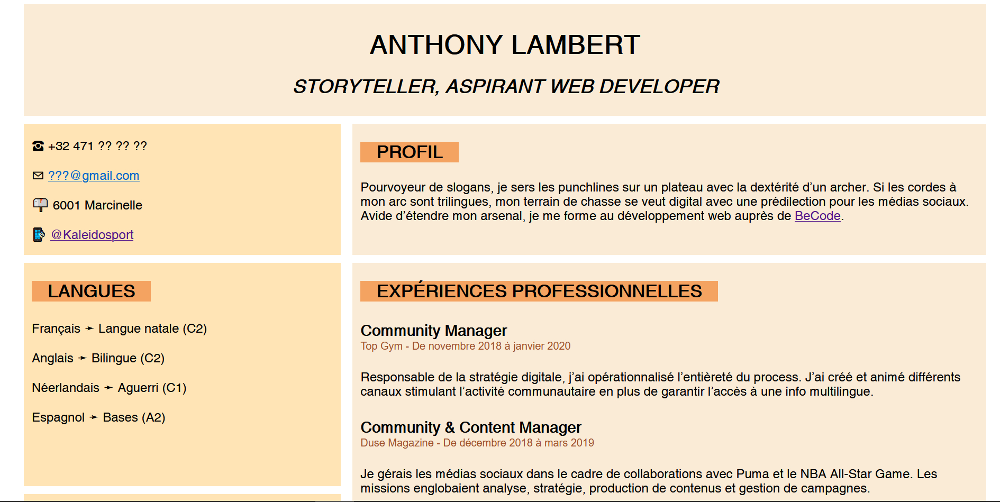
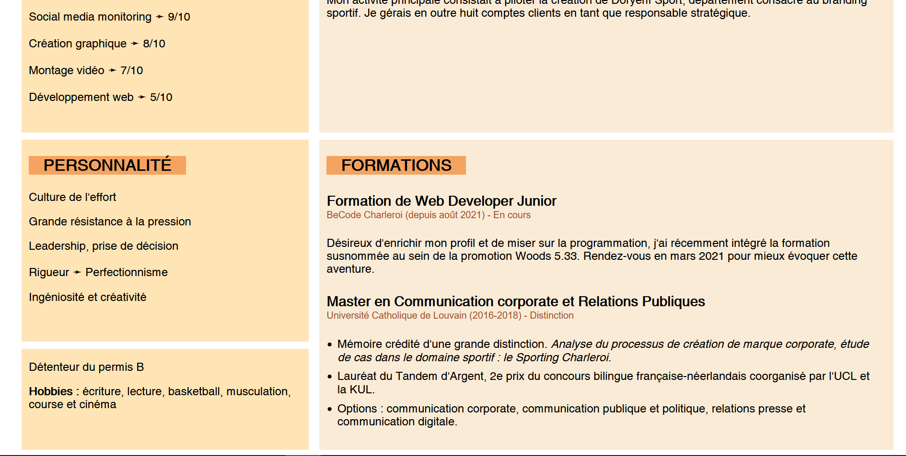

# My-CV  
  
**Auteur :** [Kaleidosport](https://github.com/Kaleidosport).  
**Contexte :** Exercice réalisé dans le cadre de la formation WebDev Junior dispensée par [BeCode](https://github.com/becodeorg), 2e partie HTML-CSS.  
**Rendu final :** [My-CV](https://kaleidosport.github.io/My-CV)  
**Date de fin :** 31/08/2021.  

---     
    
## Objectif  
  
S'approprier les techniques propres au grid-layout permis par le CSS et ébaucher une version alpha d'un CV en ligne. À noter qu'il n'est pas responsive, les media queries venant plus tard.     
  
## Prévisualisation  

↓ [CV en ligne](https://kaleidosport.github.io/My-CV/) ↓  
  
  
  