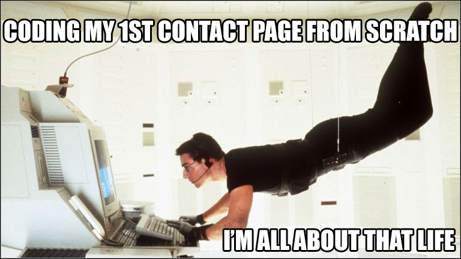
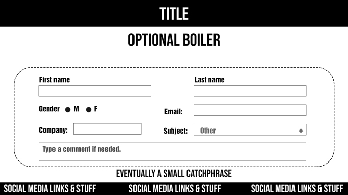
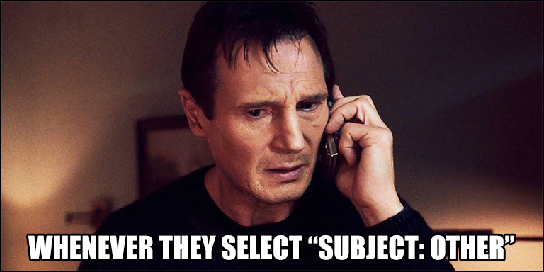

<h1 align="center">:page_with_curl: Personal contact page :mailbox_with_mail:</h1>  
  

   
  
## INCIPIT  

**Author:** [Anthony Lambert](https://github.com/Kaleidosport).  
**Context:** Solo challenge pertaining to the Junior WebDev's training provided by [BeCode](https://github.com/becodeorg).   
**Origin:** [Contact form](https://github.com/becodeorg/CRL-Woods-5.33/blob/main/1.TRAIL/03.The-Mountain/Challenge/form.md).  
**Start date:** November 15th 2021.     
**Theoretical end date:** November 19th 2021.  
**Actual end date:** November 21st 2021.  
**Online version:** [narrateur.be](http://www.playground.narrateur.be).
  
---  
  
## GAME PLAN  

    
  
First and foremost, my intent has been to comply with UI & UX's core principles since I consider those the main foundations of any website or app. I tackled the whole thing by coming up with a basic, though functional design which I know serves the aforementioned purpose. While I also took care of rendering the whole project as eye-catching and appealing as I could, I wouldn't go as far as labelling it a prospective end product. I must dig deeper to furbish my digital identity and think up a dashing brand that will reflect both my values and my work ethics.  

Leaving those aspects aside, I feel rather satisfied when it comes to judging whether or not the depicted interface meets contact forms'standards and expectations. If anything, most users should be able to know what's displayed on their screen, how they can use it and what actions it implies. That kinda déjà vu feeling can be reassuring, which is key in order to further involve those exact same users.  
  
---  

## PROGRESS STATUS  
  
#### PAGE  
    
- [x] Header -> Title  
- [x] Form -> Name and last name
- [x] Form -> Gender  
- [x] Form -> Email address  
- [x] Form -> Company name  
- [x] Form -> Subject with option "other" as default value  
- [x] Form -> Message  
- [x] Form -> Pre-complete all fields
- [x] Footer -> Contact details
- [x] Footer -> Additional branding  
  
#### ABIDING BY THE INSTRUCTIONS  

- [ ] Planning ahead: I skipped a few steps, of which a mobile-first mockup and a graphic chart    
- [x] HTML addressing accessibility  
- [x] CSS, SCSS & Bootstrap to ensure a quality layout  
- [x] PHP -> Form
- [x] PHP -> Displaying rough data
- [ ] PHP -> Processing the form data (incomplete)
- [x] Professional repository -> this should be a forte of mine  
  
#### MEETING THE REQUIREMENTS  
  
Though most of those have indeed been taken care of, the whole code is still riddled with tiny flaws that can result in a huge mess. This is mostly due to my laziness, e.a. favoring mere JavaScript alerts to proper error messages here and there.  

Lines 27, 33 and 34 indicate the latest workarounds I came up with, hence the var_dump() tests to make things work. I still have a lot more to work on, starting with the captcha. While the form is working for users who don't make a single error, it still fails to provide the adequate information in most other cases. Reworking my conditions seems like a surefire way to fine-tune the process.  

I must also reorganize the main section so that the captcha area can be perfectly aligned like the surrounding form elements. At least, I'm glad I could solve the many issues I encountered with OVH, SMTP and Gmail. This could come in handy ahead of upcoming challenges.    

---  
  
## LEARNING OBJECTIVES  

* To get a better understanding of PHP, its perks and standards.
  * To get a first-hand experience regarding backend assignments.
  * To get used to a kinda familiar, yet new syntax.
* To refresh one's memory with regards to HTML and CSS work.
* To handle a project from scratch, including a meaningful planning.  
* To test one's adaptability skills. I, for one, have to admit that both my resilience and my mental toughness have been put to the test owing to the fact I lacked genuine interest in some of the tasks at hand.  
  
---  

<h2 align="center">:email: SO, ABOUT PEOPLE GETTING IN TOUCH... :hushed:</h1>  
  

    