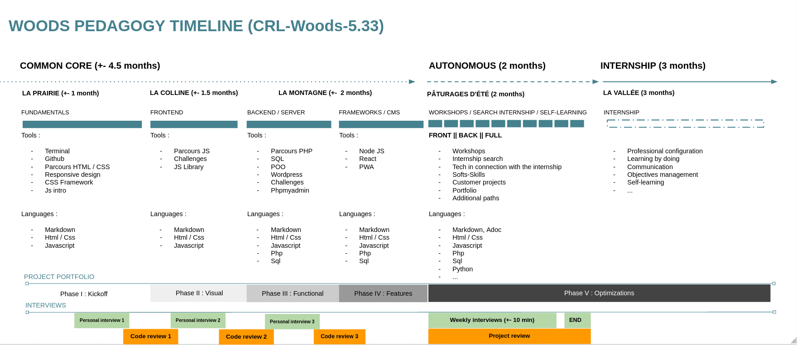

<h1 align="center">MY JOURNEY @ BECODE</h1>  

  

   
  
  
---  
    
## A foreword  
> Embracing the curve  
    
Reflecting back on where and who I was a few months ago, saying I'm grateful to [BeCode](https://github.com/becodeorg) would feel like a huge understatement. At the very least, compiling the many exercises I completed throughout the bootcamp made it clear I had progressed by leaps and bounds. I sure hope whoever goes through this repository will visualize the sweat and effort I put into this journey.  
  
Even more so than getting the hang of things when it comes to programming, I'm glad I could build back confidence and grit along the way. I'm equally glad I could lead the path at times, develop my acumen and be a collected, soothing presence for my fellow trainees. While I'm not sure this will show in my code - I know it can do a lot, but that much? -, this is my way of thanking them for making this ride such a meaningful one.  
  
## About BeCode's methodology  
> 7 months to become a web developer     
  
The organization's pedagogy emphasises on active, differentiated learning in a maieutic approach. As such, everything depends on the trainee's endeavors since each one designs his or her own blueprint for success. The more the training goes forward, the more distinct our respective paths while we're bound to help each other whenever a crewmate finds him/herself in a pinch. In my case, this means I chose to focus on React and the MERN stack as a whole, aside from nurturing my fair share of soft skills.  

    
WOODS 5.33's pedagogy timeline (click to expand)

    

  

:date: | **When:** From August 23rd 2021 to March 8th 2022.  
:school: | **Where:** [A6K](https://www.a6k.be/) in Charleroi.  
:thought_balloon: | **What:** [Junior web developer](https://becode.org/learn/junior-web-developer/) inclusive coding bootcamp.  
:open_file_folder: | **Promo:** Woods 5.33.  
:microscope: | **Head coach:** [Arnaud Duchemin](https://github.com/Cervant3s).    
      
---  

